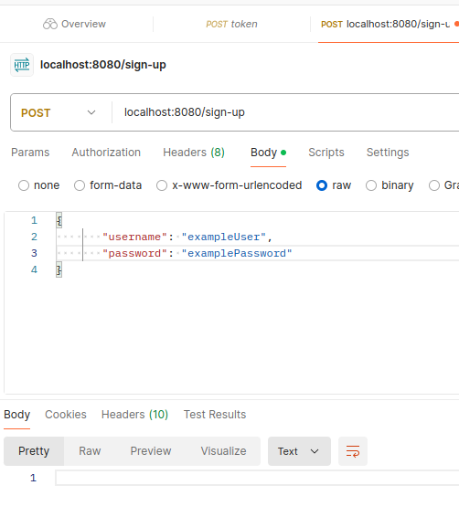
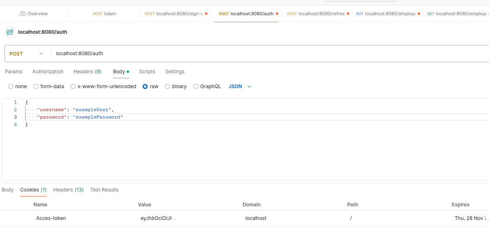
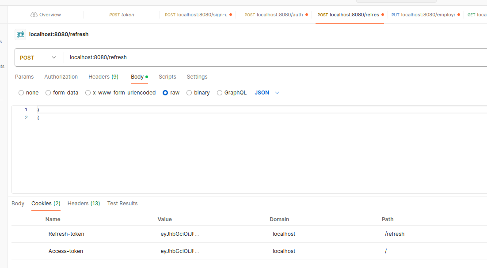

# AuthService
Simple authentication service for Information security course.

To use:
 1. Установить Maven если его нет
 2. Ввести `mvn package` в консоли находясь в папке проекта
 3. Ввести docker "build `-t spr-app:latest .` 
 4. Ввести `docker compose up`

В результате должен заработать swagger:
- http://localhost:8080/swagger-ui/index.html

Потестить можно со следующими запросами через Postman:

1. 
2. 
3. 

При заврешении работы можно ввести:
`docker compose down - v`
это остановит все запущенные контейнеры и удалит volume(ы) с данными